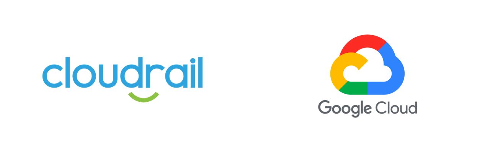

# Connecting GCP to Cloudrail



1. In the cloudrail web application, navigate to `Environments`, then the [Live Environment tab](https://web.cloudrail.app/environments/live-environment).

2. Click the ["Add Account" button](https://web.cloudrail.app/add-account) to be taken to the add account wizard.

3. Select `Google Cloud Platform` as your cloud provider.

4. Following the on-screen instructions, open a Cloud Shell session from the [Google Cloud Platform Console](https://console.cloud.google.com) in the account you wish to connect.

5. Wait for your Cloud Shell machine to provision, then login with the following command, and follow the instructions in the GCP console.

```bash
gcloud auth login
```

6. Copy and paste the commands from the Cloudrail setup instructions, and hit enter. If a prompt asks you to authorize an API call, click Authorize.

7. When a prompt asks to confirm you wish to download a key file, click Download. It will download to the default location on your local machine.

8. Upload that recently downloaded key file to the Cloudrail console.

9. Give your account a name in the account name section, and click "Test Connection". After a few moments, you should see a "Connected" message. Click Save & Continue, then click Finish.

---

## Next Steps
Next, check out how to [add custom rules and policies for your environments](getting-started/defining-policies.md).
