# Connecting Cloudrail with Terraform Enterprise
This tutorial walks through the process of setting up Terraform Enterprise with Cloudrail for performing security scans on infrastructure as code.

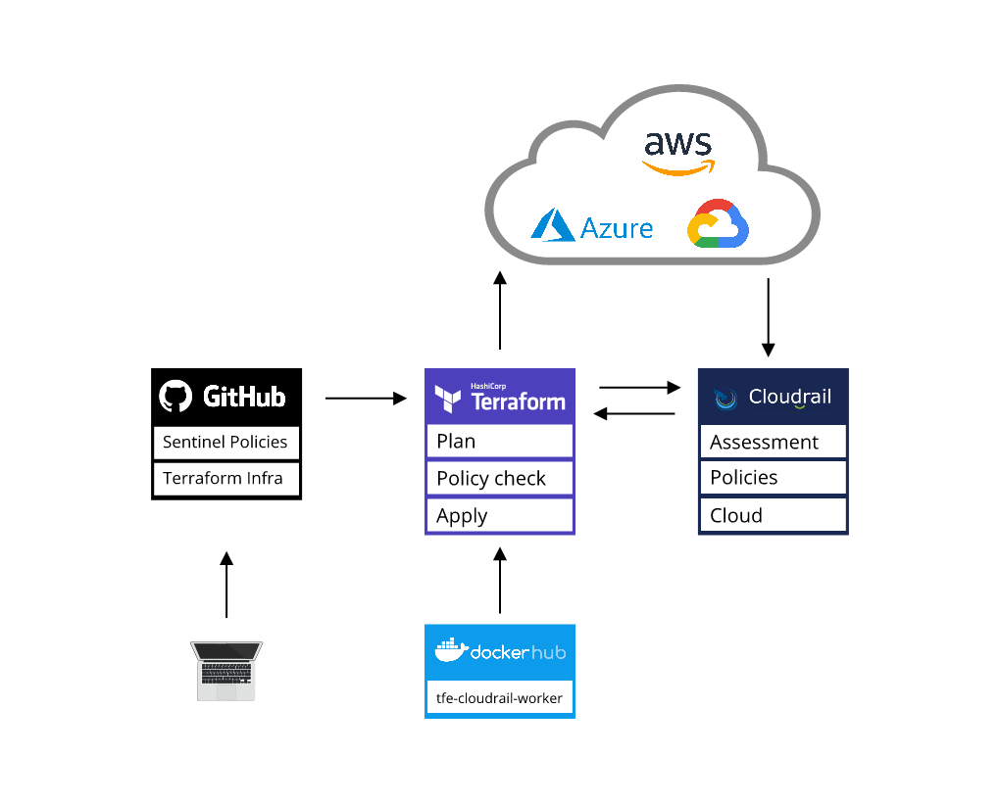

## About
Indeni Cloudrail evaluates the Terraform plan performing Infrastructure-as-Code scanning and analysing the impact of the changes in the overall cloud infrastructure.

When a Terraform plan is executed in Terraform Enterprise either manually or triggered by a change in the source code, the plan is sent to Indeni Cloudrail for a deep security and compliance analysis.

The Indeni Cloudrail Dynamic Analysis takes into consideration the infrastructure you have already deployed in the cloud, the impact of the changes introduced by the Terraform plan and how those changes introduce security risks or violate your company policies.

---

## Prerequisites

- Working installation of [Terraform Enterprise](https://www.terraform.io/docs/enterprise/index.html) (tested with version: v202109-2) with outbound Internet access to the [Cloudrail API](https://api.cloudrail.app).
- Public or private version control system (VCS)
- Cloud account (for this example we will use an AWS account)
- Cloudrail account, with the API key, and your cloud account added
- [Docker Repository](https://hub.docker.com/) (optional)

---

## How To Connect Indeni Cloudrail and Hashicorp's Terraform Enterprise


### 1. Clone the Cloudrail Repository

> Create a fork of the cloudrail repository in your VCS.

Terraform Enterprise uses a version control system as the source of its Workspaces and Sentinel rules. You can create your own Sentinel rules or use the ones provided by Indeni Cloudrail.

Cloudrail also provides the source code needed to create a Terraform Enterprise Alternative Worker that includes the Cloudrail binaries.

Fork the [Indeni Cloudrail Repository](https://github.com/indeni/cloudrail-tfe-integration/) in your own version control system:

```
https://github.com/indeni/cloudrail-tfe-integration.git
```

The repository has the code needed to build your own Docker image at `/docker`  and the Cloudrail Sentinel policies at `/tfe-cloudrail-sentinel-policies`.

---

### 2. Configure Your Cloudrail Account

> Set up your Cloudrail account, connect it to your cloud provider, grab API keys, and set a policy.

1. If you haven't already, [create a Cloudrail account](/getting-started/account-setup.md) and login.

2. Navigate to **Environments** and select **Cloud Management**.

3. Choose your cloud provider, follow the instructions to give limited access to Cloudrail so that it can scan your live infrastructure and analyze the impact of every Terraform change. The Account ID number will be used at Terraform to configure the Workspaces variable `CLOUD_ACCOUNT_ID`.

4. With Cloudrail connected to your Cloud account, find your Cloudrail API key by clicking at your name and selecting user details.

5. The Cloudrail API key will be used in each Terraform Enterprise Organization to configure the Sentinel policies and in each workspace as variable `CLOUDRAIL_API_KEY`.

*You'll end up with two environment variables, defined below*

| Environment Variable | Example Value |
| ----------- | ----------- |
| CLOUDRAIL_API_KEY | _-v_E8nNRXDNs_qoyMrxaAVlLhAaAtMS_B4NAfQO924 |
| CLOUD_ACCOUNT_ID | 1234567890 |


6. Create a Company Policy to enforce designated rules in your cloud deployments.

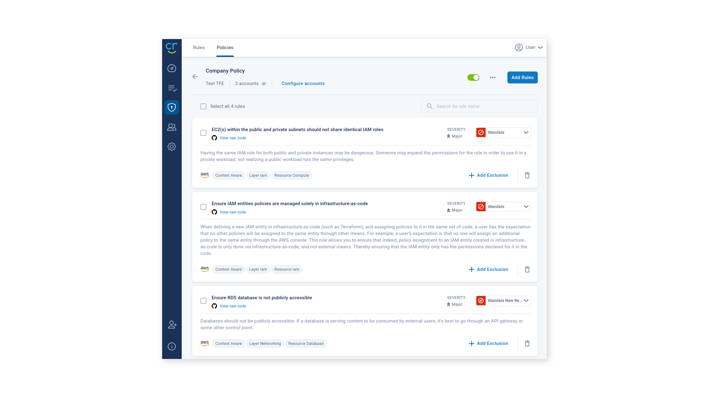

A Company policy lets you specify, for each Cloud Account, which Cloudrail rules will trigger a Sentinel policy failure in Terraform and select the enforcement level between ignore, advise, mandate or mandate only for new resources.

---

### 3. Build A Custom Terraform Worker

> Build a custom terraform worker docker image to run Cloudrail


In order to run Cloudrail with Terraform Enterprise, we'll need to build our own custom Terraform worker. For completed code, [visit our Github repository](https://github.com/indeni/cloudrail-tfe-integration/tree/master/docker/tfe-cloudrail-worker).

1. Define the necessary Dockerfile with requirements.

```docker
FROM ubuntu:focal
RUN mkdir -p /usr/share/ca-certificates/extra && \
 echo "extra/ca-certificates.crt" >> /etc/ca-certificates.conf
ADD ca-certificates.crt /usr/share/ca-certificates/extra/ca-certificates.crt
RUN apt-get update && DEBIAN_FRONTEND=noninteractive \
apt-get install -y --no-install-recommends \
   sudo unzip daemontools git-core awscli \
   ssh wget curl psmisc iproute2 openssh-client \
   redis-tools netcat-openbsd ca-certificates jq pip
RUN update-ca-certificates

SHELL ["/bin/bash", "-c"]
RUN pip install virtualenv
RUN virtualenv cloudrail
RUN source cloudrail/bin/activate
RUN pip install cloudrail
 
# This script, and all commands it invokes,
# will be executed before a Terraform Enterprise run executes 
# terraform init. This initialize script will be executed 
# during both plans and applies.
ADD init_custom_worker.sh /usr/local/bin/init_custom_worker.sh
 
# This script, and all commands it invokes, 
# will be executed after a Terraform Enterprise 
# run finishes executing terraform plan or terraform 
# apply. This finalize script will be executed during 
# both plans and applies.
ADD finalize_custom_worker.sh /usr/local/bin/finalize_custom_worker.sh
```

2. Create the init_custom_worker.sh file. This file can be empty.

```bash
touch init_custom_worker.sh
```

3. Create the finalize_custom_worker.sh file.

```bash
nano finalize_custom_worker.sh
```

```bash
#!/bin/bash
set -o allexport
 
# Read all files into environment variables
for filename in /env/*; do
 variableName=$(basename $filename)
 variableValue=$(cat $filename)
 eval ${variableName}=`echo -ne \""${variableValue}"\"`
done
 
# Debug
function debug(){
 if [ "$CLOUDRAIL_DEBUG" = true ]
 then
   echo "Environment Variables:"
   env
   cloudrail --version
   terraform --version
   echo "TFE run result: " $tfe_result
   echo "TFE run status: " $tfe_status
   echo "Cloudrail run status: " $cloudrailStatus   
   exit 1  #Force error to print debug messages   
 fi
}
 
# If CLOUDRAIL_API_KEY is not set, exit
if [ -z "$CLOUDRAIL_API_KEY" ]
then
 echo "Cloudrail CLOUDRAIL_API_KEY environment variable not set. Will not run Cloudrail"
 debug
 exit 0
fi
 
# Get Terraform run status from TFE API
tfe_result=$(curl -s --header "Authorization: Bearer $ATLAS_TOKEN" --header "Content-Type: application/vnd.api+json" ${ATLAS_ADDRESS}/api/v2/runs/${TFE_RUN_ID})
tfe_status=$(echo $tfe_result | jq -r '.data.attributes.status')
 
# Only run cloudrail during plan, check value of plan status
[ "$tfe_status" != "planning" ] && exit 0
 
# Set Cloudrail analysis
if [ "${CLOUDRAIL_STATIC:-false}" = true ]
then
 # Do Cloudrail Static Analysis --no-cloud-account
 CLOUDRAIL_MODE="--no-cloud-account"
elif [ -n "$CLOUD_ACCOUNT_ID" ]
then
 # Do Cloudrail Dynamic Analysis --cloud-account-id
 CLOUDRAIL_MODE="--cloud-account-id $CLOUD_ACCOUNT_ID"
else
 # No static or dynamic. Nothing to do.
 debug
 exit 0
fi
 
# Run Cloudrail
# Use CLOUDRAIL_EXTRA_VARS for --upload-log, --drift-track (execute 'cloudrail run --help' for other options)
cd /terraform
ORG_NAME=$(echo ${TF_VAR_TFC_WORKSPACE_SLUG} | cut -d "/" -f 1)
WS_NAME=$(echo ${TF_VAR_TFC_WORKSPACE_SLUG} | cut -d "/" -f 2)
BUILD_LINK="${ATLAS_ADDRESS}/app/${ORG_NAME}/workspaces/${WS_NAME}/runs/$TFE_RUN_ID"
 
cloudrail run -d /terraform$TF_ATLAS_DIR -p terraform.tfplan --auto-approve --origin ci $CLOUDRAIL_MODE --build-link $BUILD_LINK --execution-source-identifier $TFE_RUN_ID $CLOUDRAIL_EXTRA_VARS
cloudrailStatus=$?
 
#Print debug info
debug
 
#Not running sentinel, report errors in console if any
if [ "$CLOUDRAIL_SENTINEL" = false ]
then
 exit $cloudrailStatus;
else # CLOUDRAIL_SENTINEL true or not defined: Sentinel will report issues later on, accepts status 0 (ok) or 1 (mandated rules found violations) as sucess and continue to Sentinel
 if [[ $cloudrailStatus -eq 0 || $cloudrailStatus -eq 1 ]]; then exit 0; else exit $cloudrailStatus; fi
fi

```

4. Build the docker image.

```bash
docker build -t your_company/tfe-cloudrail-worker:latest .
```

5. Push your docker image to your remote repository.
```bash
docker push your_company/tfe-cloudrail-worker:latest
```


---

### 4. Terraform Enterprise Worker Configuration

> Configure a custom terraform worker image with Cloudrail

Terraform Enterprise uses a Docker image to run `terraform plan` and `terraform apply`. For Terraform Cloud integrations like Cloudrail, we need to define and use a custom Docker image.

1. Navigate to the Terraform Enterprise Console (know as Replicated App Manager). The console is usually published at https://terraform.yourcompany.com:8800/ and requires an administrator password.

2. In the console top menu click `Settings` and select `Terraform Build Worker image` in the left menu.

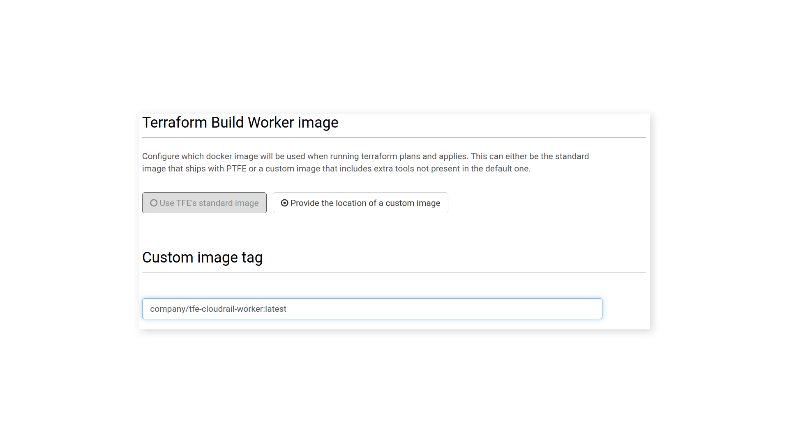

3. Select the option: "Provide the location of a custom image".

4. Define the provider, name, and tag for the Docker image in the Custom image tag field.

5. Increase the maximum amount of memory for Terraform Build Worker image to `1024 MiB`.

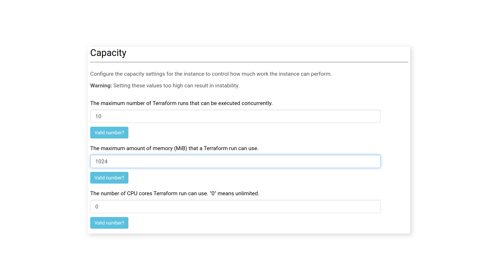

6. Save your changes by clicking the `Save` button at the bottom of the page, then the `Restart Now` button on the pop-up window.

7. Return to the Dashboard section of the console and wait until all resources have been restarted. When ready, the application status will show `Started`.

---

#### 4. Configuring Cloudrail Sentinel Policies

> Configure Cloudrail sentinel policies and policy sets in Terraform Enterprise

Our next step is to configure Cloudrail Sentinel policies that will check for the results of each Cloudrail analysis.

Terraform Enterprise uses Policy Sets that are groups of Sentinel policies which may be enforced on workspaces. Cloudrail provides two Sentinel policies to evaluate whether a run has produced advisory and/or mandatory company security rules.

1. Navigate to the Terraform Enterprise Web application. (https://terraform.yourcompany.com).

2. Select the organization to apply Cloudrail Sentinel policies, and click `Settings` in the top menu.

3. In the left menu, select Policy Sets, and click "Connect a new policy set".

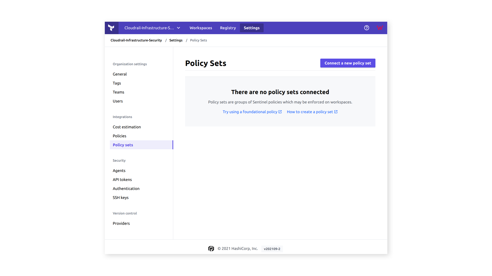

3. Select your version control provider - we'll be using **GitHub**.com for the tutorial - and follow the instructions for setup.

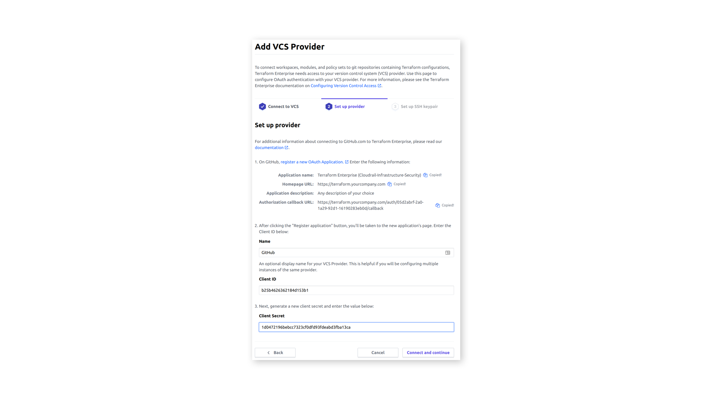

4. Authorize the provider and return to the Policy Sets section. Click "Connect a Policy Set" and select the Cloudrail Sentinel policy.

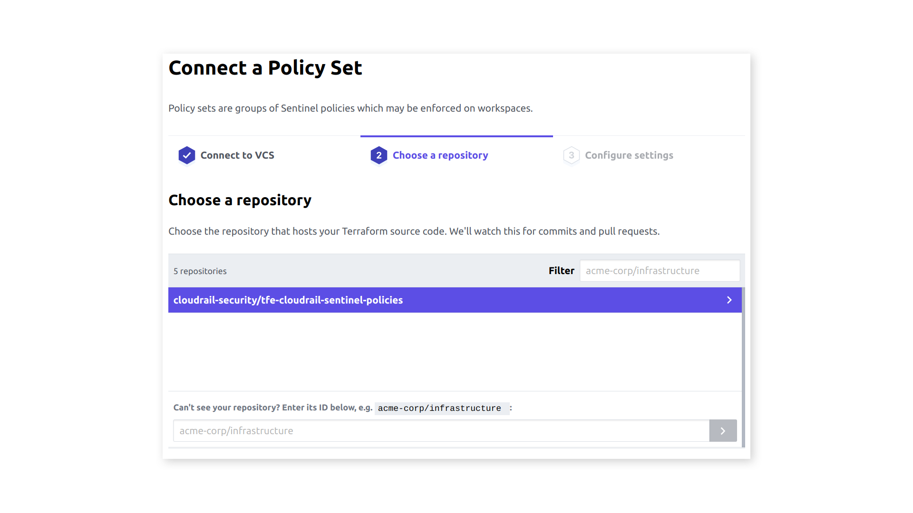

5. Click "More Options (Policies Path, VCS Branch) and write the Policies path inside the Github repository. The path should be the directory that contains the sentinel.hcl file. You can also specify a repository branch if needed.

The Scope of Policies option lets you select if the Cloudrail Sentinel Policies apply to all the workspaces in the organization or to individual workspaces.

6. Create a new Sentinel parameter `CLOUDRAIL_API_KEY` with the value from Cloudrail and select "Sensitive" to hide its value.

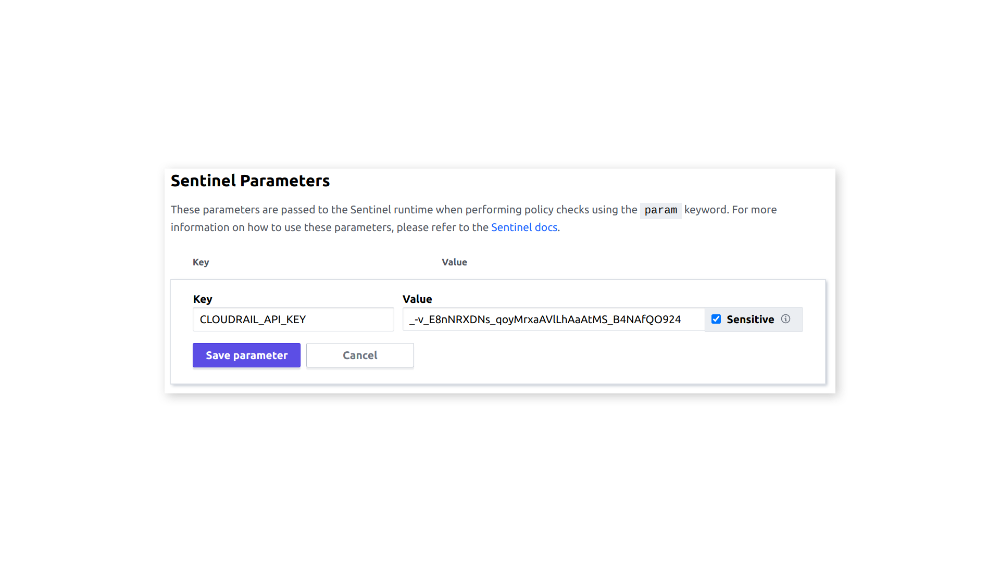

---

### 4. Configuring a Cloudrail-enabled Terraform Workspace

> Creating a workspace, enabling Cloudrail, and configuring enviropnment variables

1. Open an existing Workspace or create a new one.

For the tutorial we will be using this [Terraform example code](https://github.com/iacsecurity/tool-compare).

2. Create a fork in your own repository and a new Workspace in Terraform Enterprise that uses the Version control workflow connected to your fork of the previous GitHub repository.

The [example code repository](https://github.com/iacsecurity/tool-compare) includes many test cases, we will be using the public_and_private_ec2_same_role test that creates a Terraform plan with the same IAM roles for different compute resources - a bad security practice as modifying one role may give unintended permissions to another.

3. In advanced options for the repository specify the Terraform Working Directory (the location of the source code in the repository):

```
/test-cases/terraform/aws/iam/iam-entities/public_and_private_ec2_same_role
```

*The example creates a VPC in AWS us-east-1 with its corresponding private and public subnet, 2 EC2 instances, 3 EIP and NAT and VPN Gateways. Be aware that you might incur charges if the infrastructure is created in AWS.*

The Cloudrail enabled Terraform Workspace requires the Execution Mode to be set as  Remote. In a Remote execution, your plans and applies occur on Terraform Enterprise's infrastructure. You and your team have the ability to review and collaborate on runs within the app.

4. Create the workspace and continue with the configuration.


5. Go to the Workspace Variables configuration section and add the following Environment Variables

| Environment Variable | Example Value |
| ----------- | ----------- |
| CLOUDRAIL_API_KEY | _-v_E8nNRXDNs_qoyMrxaAVlLhAaAtMS_B4NAfQO924 |
| CLOUD_ACCOUNT_ID | 1234567890 |

You can optionally add the following bariables to customize your integration:

```bash
CLOUDRAIL_EXTRA_VARS=--upload-log
CLOUDRAIL_DEBUG=false
CLOUDRAIL_SENTINEL=true
CLOUDRAIL_STATIC=false
```

`CLOUDRAIL_EXTRA_VARS`: lets you include new parameters during the Cloudrail evaluation of the Terraform plan. (i.e. adding --upload-log uploads the execution log to Cloudrail, only in case of error, to help troubleshoot problems)

`CLOUDRAIL_DEBUG`: when set to true will output the value of all the environment variables inside the Terraform Enterprise Alternative Worker and can be useful for debug runs, when this variable is true, the Sentinel Policy Check will not run.

`CLOUDRAIL_SENTINEL`: when set to false and the Cloudrails evaluation fails it will generate a text report in the Terraform plan phase showing the Cloudrail analysis. It should be deleted or configured as true when your Terraform Enterprise has been configured to run Cloudrail Sentinel policies.

`CLOUDRAIL_STATIC`: when set to true, Cloudrail will run the evaluation without merging the Terraform plan with any target cloud environment. This means Cloudrail will focus on context-based evaluation of the resources within the plan, without taking into account any cloud-level configurations. We recommend using this feature only temporarily, and eventually  adding the target cloud environment (CLOUD_ACCOUNT_ID) and deleting or setting CLOUDRAIL_STATIC to false, to produce more precise results, as well as identify issues that are not visible through the Terraform plan alone.

You may also need to define your deployment credentials for your particular cloud for the worker to deploy changes.

```bash
AWS_ACCESS_KEY_ID=AKIAUYTUYQWBK12AS
AWS_SECRET_ACCESS_KEY=tBEhYAy5HaxsBDIeXwJ2xZg5A2yLNnX7LBGyUbC6
```

*Note*: Remember to mark variables as sensitive.

---

### 5. Execution of Terraform Plans

> Running Cloudrail in Terraform Enterprise

With everything configured, start a new plan manually from the terraform user interface, or commit a change to your GitHub repository to trigger a new automated build.

To manually execute the plan, click "Actions", "Start New Plan", define a reason for starting the plan, then click "Start Plan".

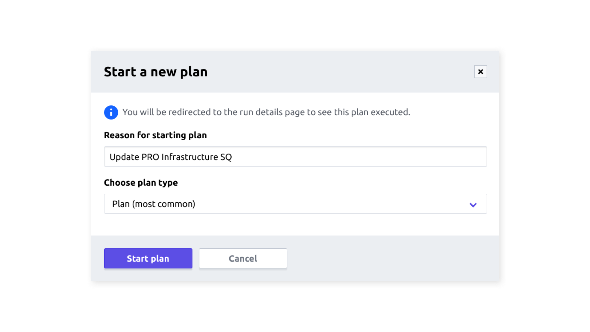

Terraform will first execute the plan step. Cloudrail then performs the dynamic analysis and policy checks. If misconfigurations or vulnerabilities that violate the defined policy are found, the plan fails, and changes won't be applied until they're fixed.

To view assessment results in Cloudrail, visit the URL shown in the "Policy check had failed" log output.

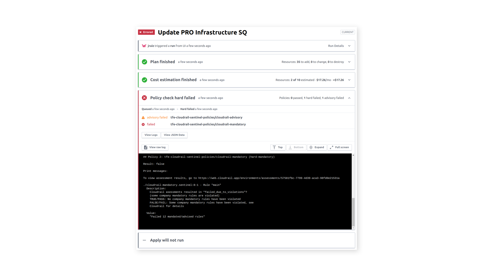

A detailed assessment is shown at the Cloudrail web interface showing Assessed Rules status, the severity of the issue, company policy compliance, the affected resources (Terraform file and line number), evidence and the remediation instructions for Terraform.

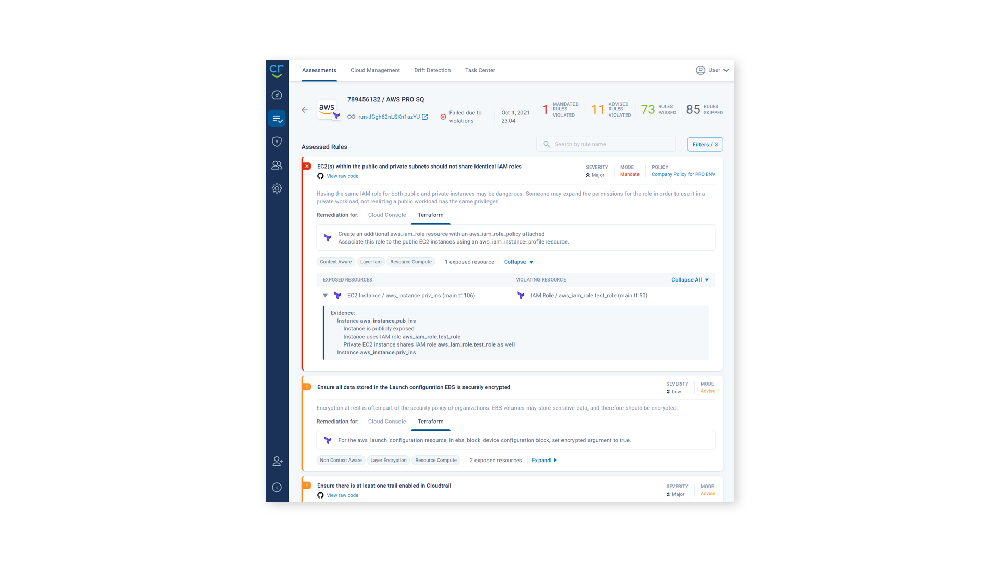

## Questions
For any questions or if you're having trouble getting things set up, feel free to reach out to community@cloudrail.app.
