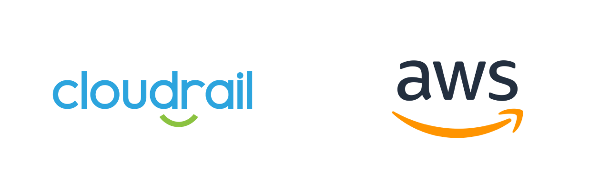

# Ensure X-Ray encryption config is set to encrypt at rest with customer-managed CMK

*Amazon Web Services (AWS) > Logging*

## Details
Cloudrail will review the X-Ray encryption config in your environment. If the encryption config is not set to encrypt at rest using a customer-managed CMK, Cloudrail will highlight it as a violation.

- **Severity**: 🟢 Low
- **Provider**: Amazon Web Services (AWS)
- **Category**: Logging
- **Rule ID**: non_car_xray_encryption_config_encrypt_at_rest_with_customer_managed_CMK

---

## Remediation
Information on how to fix "Ensure X-Ray encryption config is set to encrypt at rest with customer-managed CMK" using available methods.

####    Terraform
For the aws_xray_encryption_config resource, set the argument type to "KMS" and set key_id argument to a customer-managed CMK ARN.

####   Console
Follow the guide at <https://docs.aws.amazon.com/xray/latest/devguide/xray-console-encryption.html> to enable encryption using a customer-managed CMK.

---

## How It Works
Cloudrail will identify X-Ray encryption config within your AWS account and Terraform plan that is not configured to encrypt at rest using a customer-managed CMK.