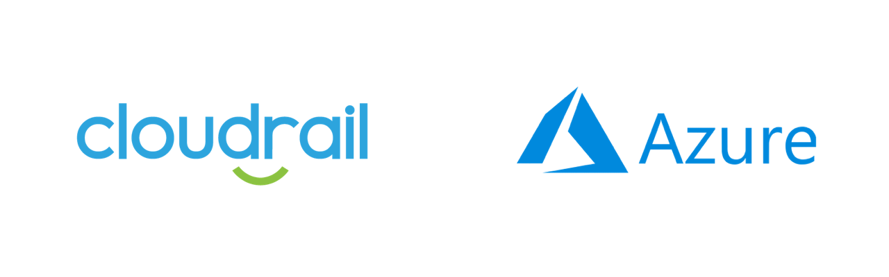

# Ensure Kubernetes cluster has Role-Based Access Control (RBAC) enabled

*Microsoft Azure > Kubernetes*

## Details
Cloudrail will review the Kubernetes cluster configuration in your environment. If a cluster is not configured with role-based access control (RBAC) enabled, Cloudrail will highlight it as a violation.

- **Severity**: 🟡 Medium
- **Provider**: Microsoft Azure
- **Category**: Kubernetes
- **Rule ID**: non_car_kubernetes_cluster_rbac_enabled

---

## Remediation
Information on how to fix "Ensure Kubernetes cluster has Role-Based Access Control (RBAC) enabled" using available methods.

####    Terraform
For the azurerm_kubernetes_cluster resource, in the role_based_access_control block set the enabled argument to true.

####   Console
Follow the guide at <https://docs.microsoft.com/en-us/azure/aks/manage-azure-rbac> in order to enable RBAC for a Kubernetes cluster.

---

## How It Works
Cloudrail will review the Kubernetes clusters configuration within your Azure subscription and Terraform plan to ensure role-based access control is enabled.