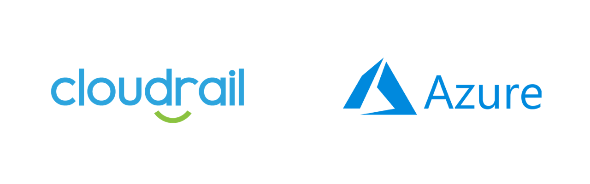

# Ensure Web App is using the latest HTTP version

*Microsoft Azure > Compute*

## Details
Cloudrail will review the Web Apps configuration in your environment. If an app, of kind "app" or "linux", does not use the latest HTTP version, Cloudrail will highlight it as a violation.

- **Severity**: 🟡 Medium
- **Provider**: Microsoft Azure
- **Category**: Compute
- **Rule ID**: non_car_web_app_using_latest_http_version

---

## Remediation
Information on how to fix "Ensure Web App is using the latest HTTP version" using available methods.

####    Terraform
For the azurerm_app_service resource, in site_config block, set the http2_enabled argument to true.

####   Console
Follow the guide at <https://azure.microsoft.com/en-us/blog/announcing-http-2-support-in-azure-app-service/> in order to configure the latest HTTP version for the Web App.

---

## How It Works
Cloudrail will review the App Service configuration, of kind "app" or "linux", within your Azure subscription and Terraform plan to check if it using the latest HTTP version. You will need to check the resource azurerm_app_service_plan, associated to the Web app (app_service_plan_id), in order to get the "kind" argument.