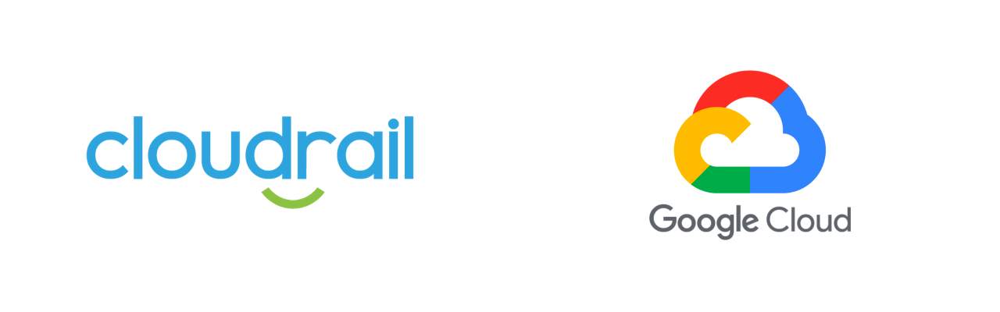

# Ensure Compute Resources are not publicly accessible via SSH

*Google Cloud Platform (GCP) > Network*



## Details
Having compute resources in a VPC accessible publicly from the Internet on known administrative or management ports can be problematic. Cloudrail will attempt to determine if compute resources within VPC are accessible directly at their public IP address, or indirectly via NAT, on SSH's port. If they are, Cloudrail will highlight it as a violation.

- **Severity**: 🔴 Major
- **Provider**: Google Cloud Platform (GCP)
- **Category**: Network
- **Rule ID**: car_vpc_not_publicly_accessible_ssh

---

## Remediation
Information on how to fix "Ensure Compute Resources are not publicly accessible via SSH" using available methods.


####    Terraform
For the google_compute_firewall resource in the ingress direction, set the source_range argument to a specific source IP address.


##### Example Vulnerable Terraform Resource
The following is an example terraform resource vulnerable to *car_vpc_not_publicly_accessible_ssh*.
```hcl
resource "google_compute_network" "default" {
  name = "default-network"
}

resource "google_compute_firewall" "example_allow_ssh" {
  name      = "example-allow-ssh"
  network   = google_compute_network.default.name
  direction = "INGRESS"
  allow {
    protocol = "tcp"
    ports    = ["22"]
  }
}


```


##### Example Fixed Terraform Resource
The following is an example terraform resource that has been patched to address the rule.
```hcl
resource "google_compute_network" "default" {
  name = "default-network"
}

resource "google_compute_firewall" "example_allow_ssh" {
  name          = "example-allow-ssh"
  network       = google_compute_network.default.name
  direction     = "INGRESS"
  source_ranges = "10.1.0.4/32"
  allow {
    protocol = "tcp"
    ports    = ["22"]
  }
}

```


####   Console
Follow the guide at <https://cloud.google.com/vpc/docs/using-firewalls#updating_firewall_rules> in order to modify the VPC Firewall rule to restrict SSH access from the Internet by setting a specific source IP address.


---

## How It Works
Cloudrail will review the VPC configuration within your GCP subscription and Terraform plan. For each VPC network, it will check the attached Firewall Rules that are reachable from the Internet, using nat ips of the compute instance(s) as well as the load balancers if there are any present in front of the compute instances. It will ensure that there is no rule matching the criteria a) Source Range is `0.0.0.0/0` b) Direction is Ingress c) IP protocol is tcp or all and d) Port is set to 22 or range containing 22 or Null (not set).