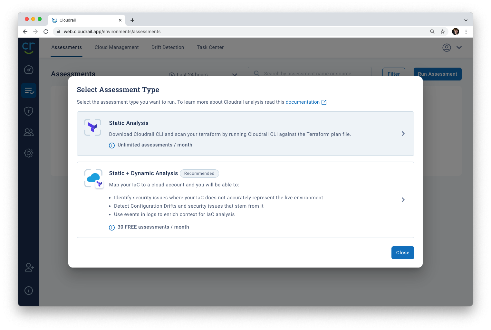
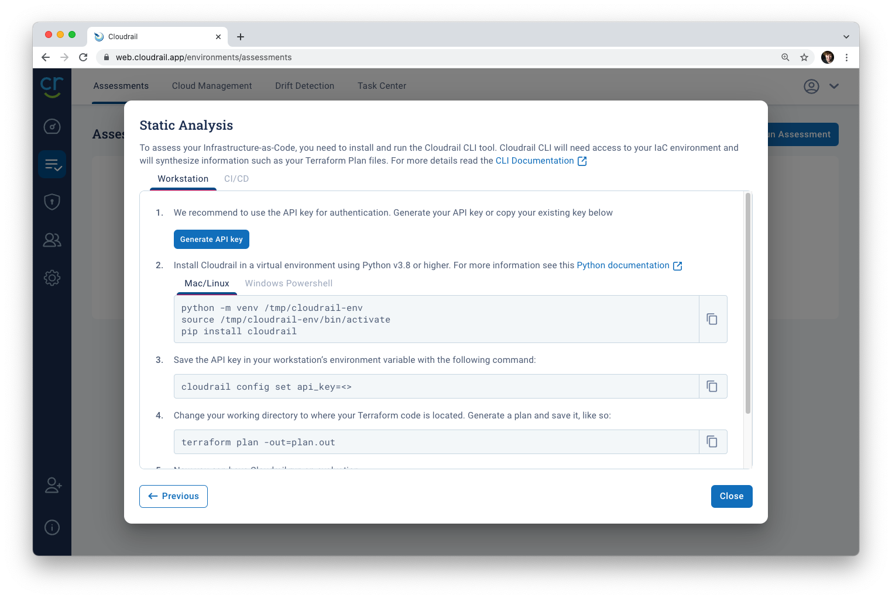
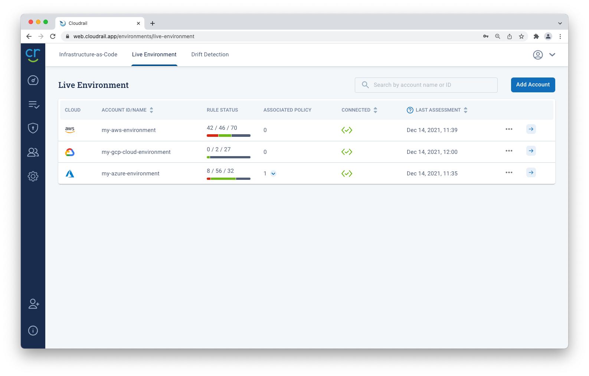
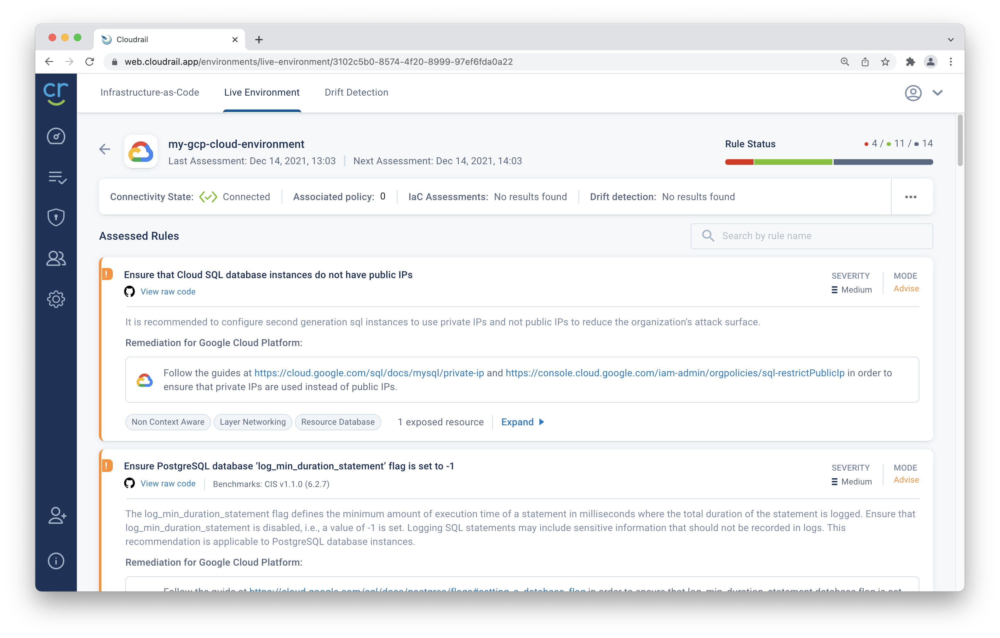

# Getting Started With Cloudrail for Google Cloud Platform (GCP)


This tutorial gives an overview on how to get started with Indeni Cloudrail for organizations using Google Cloud Platform (GCP). In this tutorial we'll walk you through a full setup of Cloudrail from Google Cloud Platform. We've divided it into four main sections.

0. Getting everything connected
1. Identifying vulnerabilties in your GCP Terraform Resources
2. Identifying issues in your live Google Cloud environment
3. Detecting drift

---

## Getting everything connected
We'll first start by getting everything connected and setup for Cloudrail to run properly.

### Install Cloudrail Locally
We'll first set up Cloudrail on your local machine. In order to do this, you must first have the latest version of python installed.

```bash
python3 --version
# Python 3.8.9
```

Next, run the following command to install Cloudrail from PyPI.
```bash
python3 -m pip install cloudrail --user
```
If you'd prefer to install to a virtual environment, with the environment activated, run this command instead.
```bash
. env/bin/activate
python -m pip install cloudrail
```

To confirm that Cloudrail has been installed properly, run the following command.

```bash
cloudrail --version
```
If you receive a command not found error, [you might need to add the python directory to your path](tutorials/install/adding-cloudrail-to-your-path.md).

### Create A Cloudrail Account
Next, create a Cloudrail account by navigating to [web.cloudrail.app](https://web.cloudrail.app/signup) and following the sign up instructions.

### Add Your API Key
We'll now retrieve an API key from the web console that the command line tool requires to run.


1. Navigate to the [web application](https://web.cloudrail.app/environments/assessments) and [go to the assessments tab](https://web.cloudrail.app/environments/assessments).

2. Click "Run Assessment" and choose "Static Analysis"



3. Select "Generate API Key" and copy that key to your clipboard.



4. Run the following command, replacing `<your_api_key>` with the API key copied to your clipboard.

```bash
cloudrail config set api_key=<your_api_key>
```

### Connect Your Google Cloud Platform Account
With Cloudrail installed on our local system, we'll now connect it to our GCP account for more dynamic assessments of our infrastructure, and features like CSPM and drift detection.

1. In the cloudrail web application, navigate to `Environments`, then the [Live Environment tab](https://web.cloudrail.app/environments/live-environment).

2. Click the ["Add Account" button](https://web.cloudrail.app/add-account) to be taken to the add account wizard.

3. Select `Google Cloud Platform` as your cloud provider.

4. Following the on-screen instructions, open a Cloud Shell session from the [Google Cloud Platform Console](https://console.cloud.google.com) in the account you wish to connect.

5. Wait for your Cloud Shell machine to provision, then login with the following command, and follow the instructions in the GCP console.

```bash
gcloud auth login
```

6. Copy and paste the commands from the Cloudrail setup instructions, and hit enter. If a prompt asks you to authorize an API call, click Authorize.

7. When a prompt asks to confirm you wish to download a key file, click Download. It will download to the default location on your local machine.

8. Upload that recently downloaded key file to the Cloudrail console.

9. Give your account a name in the account name section, and click "Test Connection".

```txt
my-gcp-cloud-environment
```

10. After a few moments, you should see a "Connected" message. Click Save & Continue, then click Finish.


---


## How to identify vulnerabilities in your Google Cloud Terraform Resources
In addition to checking for vulnerabilities in live environments, Cloudrail allows Google Cloud Platform (GCP) users to identify problems in terraform files before they go into production. Here's how to get started.

### Static Analysis
We'll first perform something called a static analysis, which allows Cloudrail to check local files on your machine for vulnerabilities without requiring access to the cloud account, or your terraform state.

We'll use an example repository with some sample GCP resources to perform this analysis locally, though you're more than welcome to use your own resources.

1. Clone the example repository and descend into it.

```bash
git clone https://github.com/indeni/cloudrail-gcp-tutorial.git
cd cloudrail-gcp-tutorial
```

2. Run cloudrail on the terraform files in that directory.

```bash
cloudrail run --auto-approve
```

3. After a few moments, Cloudrail will return a list of identified issues with your defined GCP resources.

```logs
# Example Logs
-----------------------------------------------
Rule: Ensure that logging is enabled for cloud storage buckets
 - 1 Resources Exposed:
-----------------------------------------------
   - Exposed Resource: [google_storage_bucket.example_regional_bucket] (storage.tf:1)
     Violating Resource: [google_storage_bucket.example_regional_bucket]  (storage.tf:1)

     Evidence:
             | The Google Storage Bucket logging is not enabled.
-----------------------------------------------
Summary:
7 Rules Violated:
  0 Mandated Rules (these are considered FAILURES)
  7 Advisory Rules (these are considered WARNINGS)
0 Ignored Rules
12 Rules Skipped (no relevant resources found)
10 Rules Passed

```

4. From here, we can address the issues according to the provided remediation steps, or choose to implement a custom policy and ignore them.

### Static + Dynamic Analysis
If you are in the position where you can create a terraform plan file on your local machine, you can do a comprehensive static + dynamic analysis with the following commands.

1. First, create a terraform plan with an out file.

```bash
terraform plan -out=plan.out
```

2. Next, run that plan through Cloudrail setting the `--cloudrail-account-id` argument to the name of the cloud account you chose in the above setup process.

```bash
cloudrail run -p plan.out --cloud-account-id my-gcp-cloud-environment
```

---

## Identifying Issues in your live Google Cloud environment
Now that we have Cloudrail set up and running locally on resources before they go into production, we can turn our attention to the resources that are already publicly facing.

Because we already connected our GCP account to Cloudrail in the Getting everything connected step, Cloudrail is now automatically scanning our Google Cloud Platform (GCP) environment for vulnerabilities.

### Viewing Current Issues with your GCP Environment

To see them, visit the [Live Environment](https://web.cloudrail.app/environments/live-environment) tab of the environments section of the web application.



### A Problem! CloudSQL Public IPs
We can see in our environment, Cloudrail has detected an existing postgreSQL database is using a Public IP address, which is no longer recommended since the introduction of Private IPs for CloudSQL databases.

> Ensure that Cloud SQL database instances do not have public IPs - 
*It is recommended to configure second generation sql instances to use private IPs and not public IPs to reduce the organization's attack surface.*




Once this CloudSQL instance is converted to no longer use a public IP, Cloudrail will report the rule as passing. Cloudrail checks your live cloud environment every hour for any misconfigurations.

---

## Detecting infrastructure drift in your live Google Cloud environment
Cloudrail allows you to define a baseline using terraform of what you want your Google Cloud Platform environment to look like. Any drifts from this default configuration are automatically detected and raised by Cloudrail.

To set up drift detection, we first need to set an infrastructure as code baseline. We will outline how to do this process manually, but this is best set up in your CI/CD provider on a regular basis.

## Post-Deployment Drift Detection
In a standard terraform deployment, a user will first run

```bash
terraform plan -out=plan.out
```

before reviewing, approving, and applying that plan to the infrastructure. Cloudrail is designed to run right after the `terraform plan` step, to catch any infrastructure misconfigurations.

```bash
cloudrail run -p plan.out --auto-approve
```

While this process works, we aren't able to use the `--drift-track` flag here. When using that flag, Cloudrail only considers the resources currently in production as a part of the baseline, not any new resources defined as the plan. It's for this reason we run cloudrail again with the `--drift-track` flag post-deployment, in order to set our configuration baseline and catch drifts from that point on.

Here's what it looks like in code.

```bash
# Create your plan, maybe you're adding a new compute instance
terraform plan -out=plan.out

# Run your plan through cloudrail to check for misconfigurations
cloudrail run -p plan.out \
    --cloud-account-id my-gcp-cloud-environment \
    --auto-approve
# Looks good!

# Deploy your changes to GCP
terraform apply plan.out

# Generate a new "empty" plan, now that we've applied our new changes
terraform plan -out=plan_no_changes.out

# Run cloudrail on this new plan, to set the infrastructure baseline
cloudrail run -p plan_no_changes.out \
    --cloud-account-id my-gcp-cloud-environment \
    --drift-track \
    --auto-approve

```

Cloudrail now considers the plan_no_changes.out representation of our infrastructure to be our baseline and will notify us about anything that deviates from it.

--- 

## Finishing Up
Using Cloudrail, we're able to identify current vulnerabilities in your Google Cloud Platform resources, identify when resources are changed, and perform scans on resources before they go into production all together.

Any questions? Reach out to us at [cloudrail.app/contact](https://cloudrail.app/contact) for any questions or comments.
